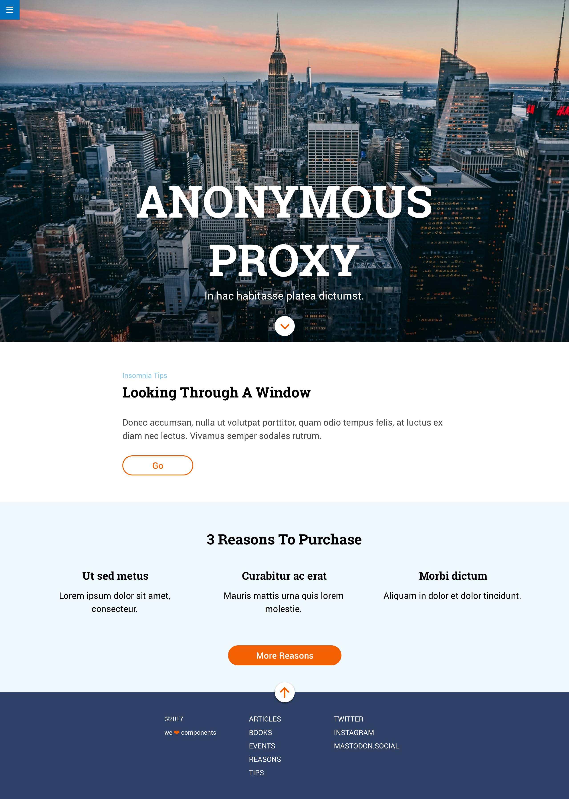

# Módulo 1: Ejercicio de evaluación final
## 👨‍💻 Paula Perera
---

### Enunciado
El ejercicio consiste en desarrollar una página web de acuerdo a un diseño dado. Hay que resolver varios
puntos:
- Usar Sass.
- Usar flexbox y CSS Grid.
- Usar media queries.
- Resolver algunas interacciones usando transiciones.

**Mockup**

**Maquetación**
1. El botón de hamburguesa (en la esquina superior izquierda) debe estar fijo en la parte superior de la pantalla y no debe desaparecer al hacer scroll. El icono de la hamburguesa debe ser un enlace a la página de Adalab. Este menú de hamburguesa no desplega ningún submenú.
2. Primer módulo (Anonymous proxy): debe estar maquetado con flexbox y debe ocupar el alto de la ventana del navegador.
3. Segundo módulo (Looking Through A Window): se puede maquetar usando las propiedades de CSS que se deseen.
4. Tercer módulo (3 Reasons To Purchase): los 3 elementos del listado deben estar maquetados con CSS Grid en todos los tamaños de pantalla.
5. Cuarto módulo (footer): se debe maquetar usando flexbox. Todos los textos de la columna "ARTICLES" y todos los textos de la columna "TWITTER" deben ser enlaces a la página de Adalab.

**Interacción**
En total, hay varias interacciones que resolver:
1. El botón de flecha del módulo hero debe enlazar a la sección "3 Reasons To Purchase".
2. El botón de flecha del footer debe enlazar al inicio de la página.
3. Todos los links del pie deben ir a https://adalab.es.
4. En el hover de los botones ("Go" y "3 Reasons To Purchase") se debe incluir una transición que
dejamos a vuestra elección (por ejemplo: color, tamaño, etc.).
5. BONUS: hacer una pequeña animación en el botón del footer.

### Consideraciones
- En Zeplin la imagen del hero tiene un degradado vertical que oscurece la parte inferior de la imagen.
- La imagen cover.jpg que nos descargamos en el Zip no tiene este degradado.
    - Este degradado no es necesario añadirlo por maquetación. Podemos ignorarlo.
- En el pie de página pone 2017. Pero debemos poner el año actual.